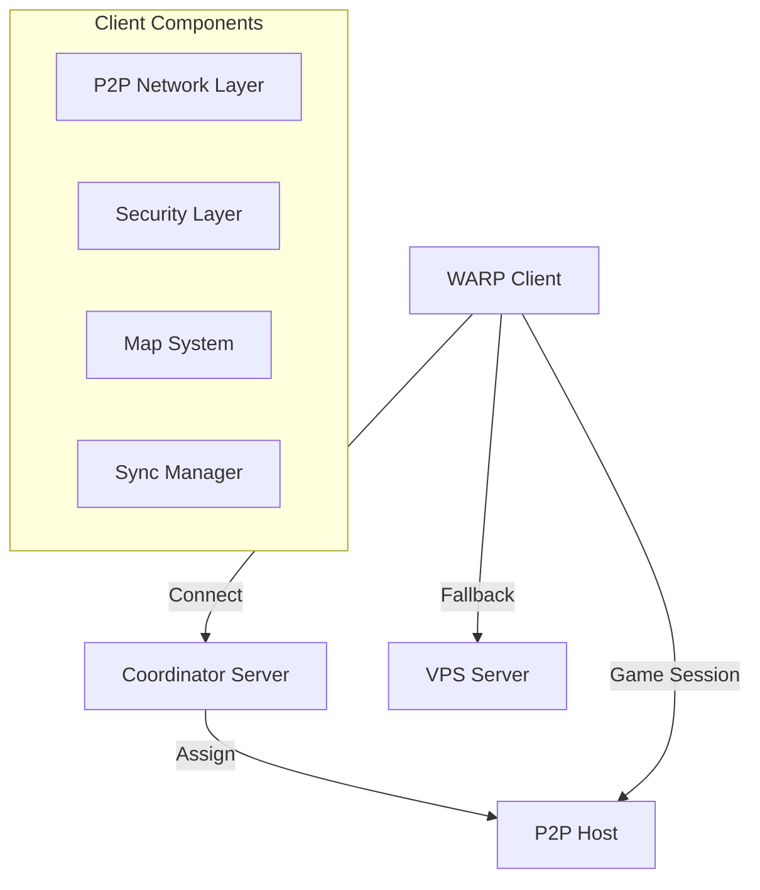

# P2P Hosting Client Implementation Guide

## Overview
This document details the implementation of P2P hosting support in the WARP client, including networking, security, and synchronization features.

## Architecture



## Implementation Steps

### 1. Network Layer Integration

#### P2P Network Manager
```cpp
class P2PNetwork {
    // Core networking functionality
    bool initialize();
    bool connect(host_info_t host);
    void disconnect();
    
    // Packet handling
    bool send_packet(packet_t packet);
    void handle_packet(packet_t packet);
    
    // Connection management
    bool check_connection();
    void handle_timeout();
    void reconnect();
};
```

#### Connection States
```cpp
enum class P2PConnectionState {
    DISCONNECTED,
    CONNECTING,
    AUTHENTICATING,
    CONNECTED,
    RECONNECTING,
    FAILING_OVER
};
```

### 2. Security Implementation

#### Packet Encryption
```cpp
class P2PSecurityLayer {
    // Key management
    void initialize_encryption();
    void rotate_keys();
    
    // Packet security
    bool encrypt_packet(packet_t& packet);
    bool decrypt_packet(packet_t& packet);
    bool verify_packet(const packet_t& packet);
};
```

#### Authentication Flow
1. Connect to coordinator
2. Receive authentication token
3. Connect to P2P host
4. Verify host certificate
5. Establish secure channel

### 3. Map System Integration

#### Map Loading Process
```cpp
bool MapSystem::load_p2p_map(map_id_t map_id) {
    // 1. Get map host from coordinator
    auto host = get_p2p_host(map_id);
    if (!host) {
        return false;
    }
    
    // 2. Connect to host
    if (!p2p_network_->connect(host)) {
        return fallback_to_vps(map_id);
    }
    
    // 3. Initialize map session
    auto session = create_map_session(map_id, host);
    if (!session->initialize()) {
        return fallback_to_vps(map_id);
    }
    
    // 4. Start synchronization
    sync_manager_->start_sync(session);
    return true;
}
```

### 4. Synchronization System

#### State Synchronization
```cpp
class SyncManager {
    // Synchronization control
    void start_sync(map_session_ptr session);
    void stop_sync();
    void update();
    
    // State management
    void sync_player_position();
    void sync_entities();
    void handle_state_update(const state_update_t& update);
    
    // Conflict resolution
    void resolve_position_conflict();
    void handle_desync();
};
```

### 5. Fallback Handling

#### Automatic Failover
```cpp
bool ConnectionManager::handle_connection_failure() {
    // 1. Detect failure
    if (!check_connection_health()) {
        // 2. Try reconnection
        if (!attempt_reconnect()) {
            // 3. Failover to VPS
            return initiate_failover();
        }
    }
    return true;
}
```

#### Recovery Process
1. Detect connection issues
2. Attempt reconnection (3 tries)
3. Switch to VPS if reconnection fails
4. Restore game state
5. Resume gameplay

### 6. Performance Monitoring

#### Metrics Collection
```cpp
struct P2PMetrics {
    uint32_t latency;
    float packet_loss;
    uint32_t bandwidth_usage;
    uint32_t state_updates;
    uint32_t sync_errors;
};

class MetricsCollector {
    void collect_metrics();
    void report_metrics();
    void check_thresholds();
};
```

## Configuration

### Network Settings
```ini
[P2P_NETWORK]
; Connection settings
MaxRetries=3
ReconnectDelay=1000
TimeoutMS=5000

; Performance settings
UpdateIntervalMS=50
MaxLatencyMS=200
PacketBatchSize=32

; Security settings
EnableEncryption=1
KeyRotationInterval=3600
```

### Security Settings
```ini
[P2P_SECURITY]
; Encryption settings
EncryptionAlgorithm=AES-256-GCM
EnableCompression=1
CompressionThreshold=1024

; Authentication
TokenValiditySeconds=3600
RequireCertificates=1
```

## Build Integration

### CMake Configuration
```cmake
# P2P support
option(ENABLE_P2P "Enable P2P hosting support" ON)

if(ENABLE_P2P)
    add_definitions(-DENABLE_P2P_SUPPORT)
    
    # Add P2P source files
    set(P2P_SOURCES
        src/network/p2p_network.cpp
        src/network/p2p_session.cpp
        src/game/p2p_map_session.cpp
        src/security/p2p_security.cpp
    )
    
    # Add dependencies
    find_package(OpenSSL REQUIRED)
    find_package(ZLIB REQUIRED)
    
    target_link_libraries(client
        PRIVATE
            OpenSSL::SSL
            OpenSSL::Crypto
            ZLIB::ZLIB
    )
endif()
```

## Testing

### Unit Tests
```cpp
TEST_CASE("P2P Connection Tests") {
    SECTION("Connection Establishment") {
        auto network = P2PNetwork::create();
        REQUIRE(network->initialize());
        REQUIRE(network->connect(test_host));
    }
    
    SECTION("Packet Encryption") {
        auto security = P2PSecurityLayer::create();
        auto packet = create_test_packet();
        REQUIRE(security->encrypt_packet(packet));
        REQUIRE(security->decrypt_packet(packet));
    }
}
```

### Performance Tests
```cpp
TEST_CASE("P2P Performance Tests") {
    SECTION("Latency Test") {
        auto session = create_test_session();
        auto latency = measure_latency(session, 100);
        REQUIRE(latency < 200);
    }
    
    SECTION("Bandwidth Test") {
        auto usage = measure_bandwidth(test_session, 60);
        REQUIRE(usage.average < 1024 * 1024);
    }
}
```

## Error Handling

### Connection Issues
```cpp
try {
    p2p_network_->connect(host);
} catch (const ConnectionError& e) {
    log_error("P2P connection failed: {}", e.what());
    handle_connection_failure();
} catch (const SecurityError& e) {
    log_error("Security verification failed: {}", e.what());
    fallback_to_vps();
}
```

### State Synchronization
```cpp
void handle_sync_error(const SyncError& error) {
    switch (error.type) {
        case SyncErrorType::DESYNC:
            request_full_state_update();
            break;
        case SyncErrorType::TIMEOUT:
            attempt_resync();
            break;
        case SyncErrorType::CONFLICT:
            resolve_state_conflict();
            break;
    }
}
```

## Debugging

### Debug Commands
```cpp
/p2p status          # Show connection status
/p2p metrics         # Show performance metrics
/p2p debug on/off    # Toggle debug mode
/p2p reconnect       # Force reconnection
/p2p failover        # Force VPS failover
```

### Logging
```cpp
#ifdef P2P_DEBUG
    #define P2P_LOG(level, msg, ...) \
        Logger::log(level, "[P2P] " msg, __VA_ARGS__)
#else
    #define P2P_LOG(level, msg, ...)
#endif
```

## Deployment

1. Apply patches:
   ```bash
   patch -p1 < patches/p2p_hosting.patch
   ```

2. Update configuration:
   ```bash
   cp config/p2p.ini Data/
   ```

3. Build with P2P support:
   ```bash
   cmake -DENABLE_P2P=ON ..
   make
   ```

4. Test deployment:
   ```bash
   ./run_p2p_tests.sh